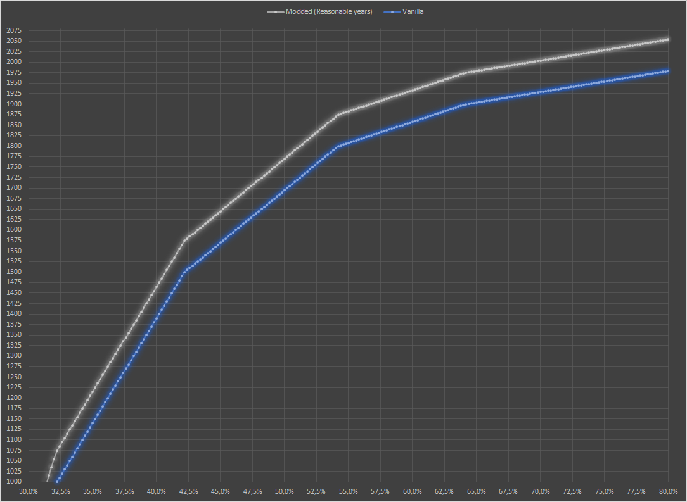

# Reasonable-years
This is a mod for Civilization 6. You may be interested in the mod if you like the game.

Do you play more then average difficulty calmly?

Maybe you even beat Diety on a regular basis?

In either case you may have noticed some discrepancy: you can easily into space in... 1860 AD.

Unrealistic, isnt it? Not anymore!
With reasonable years game turns will correlate more reasonable with years shown.
As you will see later, for the same % of game length in turns there will be more years passed.
For example, what was year 1944 in vanilla - will be 2010 in modded game.

A brief comparasion of year/turn relation (for a standard gamespeed) is in the graph:

This is "cosmetic" change and doesn't alter gameplay in any shape or form.

You can install this mod via steam (subscribe in workshop):
https://steamcommunity.com/sharedfiles/filedetails/?id=2022612469

Also it is possible to manualy install mod. To do this you need to extract zip files (Releases) to My Documents/My Games/Sid Meier's Civilization VI/Mods.
After this start the game and click on additional content and you can enable the mod by ticking the respective checkbox.
